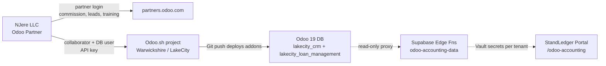

# NJere LLC × Warwickshire / LakeCity — Odoo 19 Partner Onboarding

> Owner: NJere LLC (Odoo Partner of record for Warwickshire PVT Ltd)
> Customer: Warwickshire PVT Ltd, operating LakeCity (land development, BNPL contracts)
> Hosting: Odoo 19 on Odoo.sh
> Tenant slug in StandLedger: `lakecity`

This folder is the operational runbook NJere uses to (1) activate the Odoo Partner relationship, (2) gain integrator access to Warwickshire's LakeCity Odoo 19 database hosted on Odoo.sh and deploy the two custom addons, and (3) wire StandLedger's Supabase Vault credentials so the `/odoo-accounting` page goes live.

## What you're connecting

Three independent credential sets, in this order:

| Track | What | Who clicks | Output |
|---|---|---|---|
| [A](./track-a-partner-portal.md) | NJere activates `partners.odoo.com` and links Warwickshire | NJere lead + Warwickshire admin | NJere shows as Partner of record on Warwickshire's subscription |
| [B](./track-b-odoo-sh-and-database.md) | Integrator access to Warwickshire's Odoo.sh project + LakeCity DB; deploy `lakecity_crm` and `lakecity_loan_management` (Odoo 19) | Warwickshire Odoo.sh owner + NJere engineer | Both modules installed on production; API key in NJere's hands |
| [C](./track-c-vault-wiring.md) | Wire Supabase Vault and bring `/odoo-accounting` online for tenant `lakecity` | NJere engineer | KPI dashboard rendering live numbers |

## Repository artifacts referenced by this runbook

- Odoo addons (the deliverable on Odoo.sh):
  - [`odoo/addons/lakecity_crm`](../../odoo/addons/lakecity_crm) — Collection Schedule (mirror of legacy spreadsheet, 12–120 month terms, agreement workflow)
  - [`odoo/addons/lakecity_loan_management`](../../odoo/addons/lakecity_loan_management) — BNPL loan contracts, schedules, payments
- Edge functions that read Vault:
  - [`supabase/functions/_shared/odoo-client.ts`](../../supabase/functions/_shared/odoo-client.ts) — JSON-RPC client + `getOdooConfig(tenantId)` Vault reader
  - [`supabase/functions/odoo-accounting-data/index.ts`](../../supabase/functions/odoo-accounting-data/index.ts) — read-only proxy for `/odoo-accounting`
- Frontend route:
  - [`src/pages/OdooAccounting.tsx`](../../src/pages/OdooAccounting.tsx) (mounted in [`src/App.tsx`](../../src/App.tsx) at `/odoo-accounting`)
- Track C tooling:
  - [`scripts/setup-lakecity-odoo-vault.sh`](../../scripts/setup-lakecity-odoo-vault.sh) — interactive secret setter
  - [`docs/sql/lakecity-odoo-vault-secrets.sql`](../sql/lakecity-odoo-vault-secrets.sql) — copy-paste SQL fallback

## Working order

1. Track A first (commercial relationship — unblocks everything else).
2. Track B in parallel with the **second** half of A (B1/B2 don't depend on A's discount being applied, only on Warwickshire's willingness to grant access).
3. Track C last (depends on B2's API key).

When a step is gated on someone else (Odoo CSM, Warwickshire admin), record a started/completed date in the matching Track file so we always know who's blocking.
