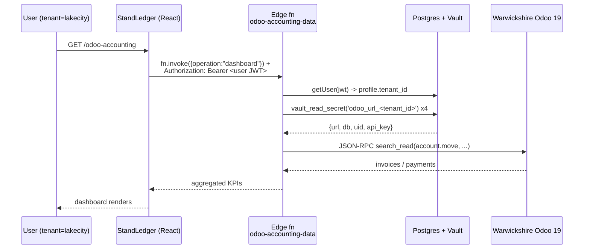

# Track C — Wire StandLedger's Supabase Vault and bring `/odoo-accounting` online

Goal: With the four Odoo 19 credentials captured in [Track B2](./track-b-odoo-sh-and-database.md#b2-internal-database-user--api-key), the LakeCity tenant resolves them via Supabase Vault and the [`/odoo-accounting`](../../src/pages/OdooAccounting.tsx) page renders live KPIs, invoices, payments, and aged AR.

## How the wiring works (one diagram)



The function's source of truth for credential names: [`supabase/functions/_shared/odoo-client.ts`](../../supabase/functions/_shared/odoo-client.ts) lines 17–33.

## Pre-flight

Before touching Vault, make sure all of these are true:

- [ ] [Track B](./track-b-odoo-sh-and-database.md) is signed off — the four values exist in NJere's secrets manager.
- [ ] You can connect to the LakeCity Supabase project's Postgres with sufficient privileges to call `vault.create_secret()` / `vault.update_secret()`. The simplest credential is the `postgres` role's connection string from *Supabase Project → Settings → Database → Connection string*; export as `SUPABASE_DB_URL`.
- [ ] `psql`, `jq`, `curl` are on your `PATH`.
- [ ] LakeCity tenant exists: `SELECT id, slug FROM public.tenants WHERE slug='lakecity';` returns one row. If not, see [`docs/sql/lovable-ensure-tenants-lakecity.sql`](../sql/lovable-ensure-tenants-lakecity.sql) first.

## C1. Set the four Vault secrets

Two equivalent paths — pick one.

### Path A — Interactive helper (recommended)

```bash
export SUPABASE_DB_URL='postgres://postgres:<password>@db.<project>.supabase.co:5432/postgres'

bash scripts/setup-lakecity-odoo-vault.sh
```

The script:

1. Resolves the LakeCity tenant UUID from the `tenants` table.
2. Prompts for `odoo_url`, `odoo_db`, `odoo_uid`, `odoo_api_key` (the API key is hidden on input).
3. **Sanity-checks the credentials by hitting `<odoo_url>/jsonrpc`** and reading back `res.users`. If Odoo rejects the credentials, the script aborts before writing anything.
4. Upserts the four secrets into Vault (idempotent — re-running with new values updates them in place).
5. Reads them back via `vault_read_secret(...)` to prove the round-trip.

Use `--dry-run` to run the validation pass without writing.

### Path B — Manual SQL (if you can't run shell scripts)

Open the Supabase SQL Editor and run [`docs/sql/lakecity-odoo-vault-secrets.sql`](../sql/lakecity-odoo-vault-secrets.sql), passing the five `\set` variables either via the `:variable` mechanism or by replacing the `\if :{?...}` guards with `\set` defaults.

Easier in psql:

```bash
psql "$SUPABASE_DB_URL" \
  -v ON_ERROR_STOP=1 \
  -v tenant_id="$(psql "$SUPABASE_DB_URL" -tAc \
                  "SELECT id FROM public.tenants WHERE slug='lakecity'")" \
  -v odoo_url='https://lakecity.odoo.com' \
  -v odoo_db='lakecity-production-12345' \
  -v odoo_uid='12' \
  -v odoo_api_key='ak_xxxxxxxxxxxxxxxx' \
  -f docs/sql/lakecity-odoo-vault-secrets.sql
```

Verification (either path):

```sql
SELECT
  public.vault_read_secret('odoo_url_'      || (SELECT id FROM tenants WHERE slug='lakecity')) AS url,
  public.vault_read_secret('odoo_db_'       || (SELECT id FROM tenants WHERE slug='lakecity')) AS db,
  public.vault_read_secret('odoo_uid_'      || (SELECT id FROM tenants WHERE slug='lakecity')) AS uid,
  LEFT(public.vault_read_secret('odoo_api_key_' || (SELECT id FROM tenants WHERE slug='lakecity')), 6) || '...' AS key_preview;
```

Sign-off:

- [ ] All four `vault_read_secret(...)` calls return non-NULL strings.
- [ ] The masked API key prefix matches what NJere recorded in Track B2.

## C2. Deploy edge functions (if not already deployed)

```bash
bash scripts/deploy-supabase-functions.sh
```

This script deploys every function under [`supabase/functions/`](../../supabase/functions/) including [`odoo-accounting-data`](../../supabase/functions/odoo-accounting-data/index.ts), [`odoo-sync-payment`](../../supabase/functions/odoo-sync-payment/index.ts), and [`odoo-webhook`](../../supabase/functions/odoo-webhook/index.ts).

If only `odoo-accounting-data` changed, deploy just that one to skip waiting for the others:

```bash
supabase functions deploy odoo-accounting-data --project-ref <PROJECT_REF>
```

Sign-off:

- [ ] `odoo-accounting-data` shows the latest deployed version in *Supabase → Edge Functions*.

## C3. Smoke-test from the app

1. Sign in to StandLedger with a user whose `profiles.tenant_id` resolves to the LakeCity tenant.
2. Open `/odoo-accounting`. The very first call the page makes is `operation: "ping"` against [`odoo-accounting-data/index.ts`](../../supabase/functions/odoo-accounting-data/index.ts) — if you see a yellow banner reading "Odoo isn't connected for this tenant yet", a Vault secret is missing or the JWT couldn't resolve a tenant.
3. The dashboard loads four KPIs:
   - **Total Receivable** (sum of `account.move.amount_residual` for open posted invoices)
   - **Overdue** (subset where `invoice_date_due < today`)
   - **Collected (MTD)** (`account.payment` posted/reconciled this month)
   - **As of** (today)
4. Click into the **Invoices** and **Payments** tabs. Filter `Open` / `Overdue` / `Paid`. Search by invoice number or partner name.
5. Click **Aged AR**. Five buckets and a customer rollup appear, sorted descending by total balance.

If any tab shows the "Couldn't reach Odoo" banner with a non-Vault error message, capture the error — it will say either "Odoo HTTP error: 5xx" (Odoo.sh issue), "Odoo RPC error: ..." (permissions/data issue), or a Postgres error (Vault still misconfigured).

Sign-off:

- [ ] Ping returns `{ok:true, odoo_url, db}`.
- [ ] Dashboard KPIs render with non-zero (or zero-but-correct) values.
- [ ] Invoices, Payments, Aged AR tabs render without errors.

## C4. Hardening — switch from a human user to a service integration user

This is **strongly recommended** but does not block initial go-live.

The Track B2 API key was minted on the `NJere Integrator` user — a human account. If that human leaves NJere, their account gets deactivated and `/odoo-accounting` instantly breaks. Fix once with a dedicated integration user:

### C4.1 Create the service user on Odoo

In the LakeCity production database, Settings → Users:

| Field | Value |
|---|---|
| Login | `integration+standledger@lakecity.com` (or `+standledger` on whichever inbox NJere monitors) |
| Name | `StandLedger Portal Integration` |
| User Type | **Public**? **No** — keep **Internal User** (Public can't read most accounting models even with groups). |
| Access Rights — Sales | Settings: leave **None** |
| Access Rights — Accounting | **Accountant** (read-only is sufficient for v1; if you later post payments from the portal, bump to **Billing Administrator**). |
| Access Rights — Lakecity CRM | **User: Read & Update** (read schedules) |
| Access Rights — Lakecity Loans | **Lakecity Loan User** |
| Administration | leave **None** |

Save and *Send Password Invitation* to the dedicated mailbox.

### C4.2 Generate a fresh API key on the service user

Have someone on NJere log into the dedicated mailbox, accept the activation, set a strong password, **enable 2FA**, then *Preferences → Account Security → New API Key* labelled `StandLedger portal — service`.

### C4.3 Rotate Vault to the new key

Run the helper again with the new `odoo_uid` (the service user's id) and the fresh `odoo_api_key`:

```bash
bash scripts/setup-lakecity-odoo-vault.sh
```

The script's idempotent upsert silently overwrites existing secrets. Verify the next `/odoo-accounting` page load still works, then revoke the original API key on the `NJere Integrator` user under *Preferences → Account Security*.

Sign-off:

- [ ] Service user created with read-only Accounting + read-only Lakecity groups.
- [ ] Old API key revoked on the human user.
- [ ] `/odoo-accounting` still renders.
- [ ] Calendar reminder set for **annual API key rotation**.

## Operational notes

- **One Vault per Supabase project.** If StandLedger has separate Supabase projects for staging and production, run Track C against each.
- **Tenant slug vs UUID.** Vault keys are suffixed by the UUID, *not* the slug. The script and SQL handle the lookup; if you copy-paste secrets through Supabase Studio's Vault UI, double-check you used the UUID.
- **Multi-tenant.** This same playbook applies for the `richcraft` tenant — pass `TENANT_SLUG=richcraft bash scripts/setup-lakecity-odoo-vault.sh` and feed Richcraft's Odoo credentials.
- **Outage recovery.** If `/odoo-accounting` suddenly stops working, hit the edge function's `ping` operation directly (e.g. via a curl with a valid Supabase user JWT). It returns the URL and DB it resolved from Vault — instantly tells you whether Vault returned the right credentials or whether Odoo itself is down.
